<p align="center">
  
</p>

<p align="center">
  <strong>A high-precision, zero-build Web Intelligence &amp; In-Page Diagnostic Suite for Chromium browsers.</strong>
</p>

<p align="center">
  
  
  
  
  
</p>

---

## Overview

**OmniLens** is an open-source developer tool and web intelligence suite built with pure modern JavaScript. Operating directly inside Chrome's dedicated side panel and the live viewport, OmniLens audits web pages in real-time without injecting heavy third-party bundles or leaving your active workflow.

Designed with a sharp dark monochrome aesthetic and bone-cream precision accents, it focuses on high signal, zero bloat, and instantaneous feedback.

---

## Core Capabilities

### 1. In-Page Element Picker & Frame-Locked Inspector
- **Sub-Pixel Tracking**: Element highlights utilize continuous `requestAnimationFrame` synchronization with captured scroll and resize events. Overlays stay 100% glued to elements through smooth-scrolling, layout animations, and custom scroll containers.
- **Interactive Picker**: Click the crosshair or press <kbd>Alt+Shift+L</kbd> to hover over any DOM node on the page, inspect its tag name, dimensions, classes, and font styling, and click to inspect its computed properties.

### 2. Accessibility & Document Health (WCAG 2.1 Level AA)
- **Relative Luminance Engine**: Computes exact contrast ratios between foreground text and rendered backgrounds using the W3C WCAG 2.1 formula.
- **Structural Integrity Auditing**: Flags missing image `alt` attributes, unlabeled form controls, broken heading hierarchies (skipped levels), duplicate element IDs, and missing document landmarks.
- **One-Click Pinpointing**: Click "Inspect" next to any finding to scroll to and highlight the exact DOM node on the active page.

### 3. Palette & Typography Extractor
- **60fps Batched Sampling**: Traverses rendered elements across the DOM using `requestAnimationFrame` batches to prevent layout thrashing on heavy single-page apps.
- **Live Contrast Inspector**: Select any swatch to evaluate WCAG AA and AAA compliance against light and dark backgrounds.
- **Instant Export**: Copy individual colors in HEX, RGB, or HSL, or export the entire document palette as CSS Custom Properties (`:root { --color-1: ... }`).
- **Font Discovery**: Catalogs every active font family and its distribution.

### 4. Asset & Media Harvester
- **Vector & Raster Scraper**: Detects images, embedded SVG graphics, video, audio, external links, scripts, and stylesheets.
- **Clean SVG Copying**: Preview and copy sanitized SVG vector markup directly to your clipboard.
- **Filterable Gallery**: Filter by asset type with real-time text query filtering.

### 5. Smart Reader Mode & Density Heuristics
- **Content Isolation**: Identifies primary article content by evaluating paragraph clustering and link density penalties.
- **Readability Scoring**: Calculates estimated reading time, total word count, sentence metrics, top keyword frequency, and the Flesch-Kincaid Reading Ease score.
- **Clean Text Export**: Copy distraction-free article text in seconds.

### 6. Isolated JavaScript Scratchpad & Console
- **Sandboxed Execution**: Run arbitrary JavaScript safely inside an isolated Manifest V3 iframe via `postMessage` protocol with zero CSP violations.
- **Live Page DOM Queries**: Query active page selectors directly and inspect results in the embedded monospace terminal.
- **Snippet Library**: Save and load reusable JavaScript snippets stored in `chrome.storage.local`.

---

## Quick Start & Installation

OmniLens requires **no compilation, no node_modules, and no build step**. It runs on native browser standards.

### 1. Download or Clone
```bash
git clone https://github.com/vallkyrionfr/omnilens.git
```
*(or download and extract the repository ZIP file).*

### 2. Load into Chromium
1. Open **Google Chrome** (or Brave, Edge, Arc).
2. In your address bar, navigate to `chrome://extensions/`.
3. Enable the **Developer mode** toggle in the top-right corner.
4. Click the **Load unpacked** button.
5. Select the folder wherever you downloaded or extracted the repository.
6. The **OmniLens** aperture icon will appear in your extensions toolbar!

---

## Keyboard Shortcuts & Usage

| Trigger | Action |
| :--- | :--- |
| <kbd>Alt</kbd> + <kbd>Shift</kbd> + <kbd>L</kbd> | Toggle OmniLens Side Panel |
| <kbd>Esc</kbd> | Exit in-page Element Picker |
| **Right-Click &rarr; OmniLens** | Open side panel or capture text selection to scratchpad |

---

## Local Verification & Testing

OmniLens comes with a comprehensive standalone testbed and automated unit test suite.

```bash
# Run unit tests (29/29 assertions: colors, contrast, syllables, readability)
npm test

# Launch the zero-dependency local playground
npm start
```

Visit the local server in your browser:
- **Testbed Playground**: `http://localhost:3000/testbed/index.html`
- **Side Panel Preview**: `http://localhost:3000/src/sidepanel/sidepanel.html`

---

## Repository Architecture

```
omnilens/
├── manifest.json                  # Manifest V3 specification
├── package.json                   # Scripts & project metadata
├── server.js                      # Zero-dependency local dev server
├── CHROMEWEBSTORE.md              # Store listing metadata & privacy justifications
├── assets/
│   └── banner.svg                 # Animated SVG header banner
├── icons/                         # 16x16, 48x48, 128x128 PNG icons
├── scripts/
│   └── generate-icons.py          # Minimalist aperture icon generator
├── src/
│   ├── background/
│   │   └── service-worker.js      # Background SW (storage, alarms, badges, context menus)
│   ├── content/
│   │   ├── content-script.js      # Frame-locked DOM inspector, picker, and auditor
│   │   └── content-style.css      # In-page element highlight box styling
│   ├── core/
│   │   ├── accessibility.js       # WCAG 2.1 AA audit engine (missing alt, labels, contrast)
│   │   ├── colors.js              # Color parser, luminance, contrast, WCAG evaluation
│   │   ├── harvester.js           # Images, SVGs, stylesheets, scripts, link scraper
│   │   ├── inspector.js           # DOM metrics, heading hierarchy, tech stack detector
│   │   └── reader.js              # Article density heuristics & Flesch reading ease
│   ├── popup/
│   │   ├── popup.html             # Action popup HTML
│   │   ├── popup.css              # Action popup dark theme styling
│   │   └── popup.js               # Quick snapshot & side panel launcher
│   ├── sandbox/
│   │   ├── sandbox.html           # Isolated iframe environment
│   │   └── sandbox.js             # Sandboxed code evaluator via postMessage
│   └── sidepanel/
│       ├── sidepanel.html         # Multi-tab side panel UI
│       ├── sidepanel.css          # Sharp dark monochrome stylesheet
│       └── sidepanel.js           # Side panel controller
├── test/
│   └── test-runner.js             # Automated unit test suite
└── testbed/
    └── index.html                 # Comprehensive interactive testbed
```

---

## Privacy & Security

OmniLens executes strictly on your device:
- **Zero Remote Telemetry**: No analytics or tracking scripts.
- **Zero Third-Party APIs**: No external fonts, CDNs, or remote dependencies.
- **Sandboxed Execution**: Arbitrary code execution occurs solely within an isolated Manifest V3 sandbox frame.

---

## License

[MIT](LICENSE) &copy; 2026
